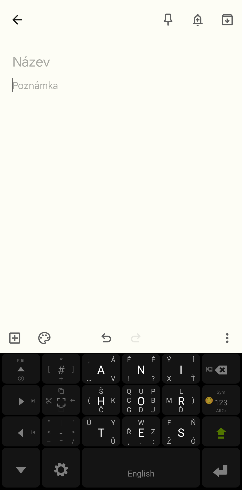
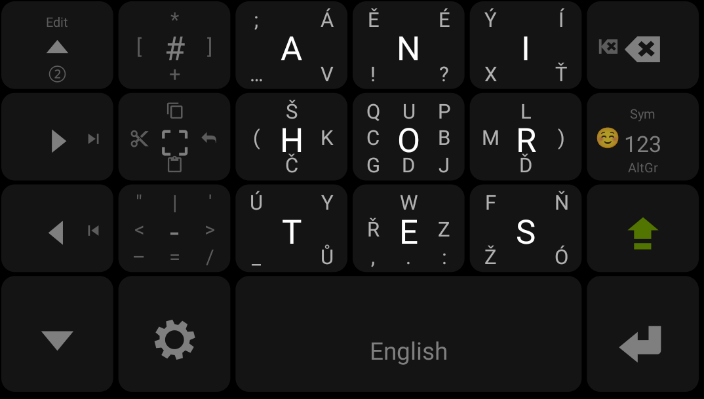
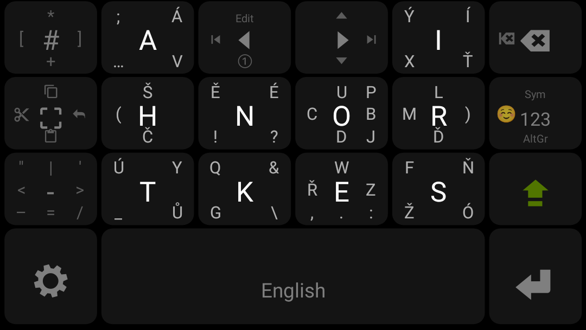
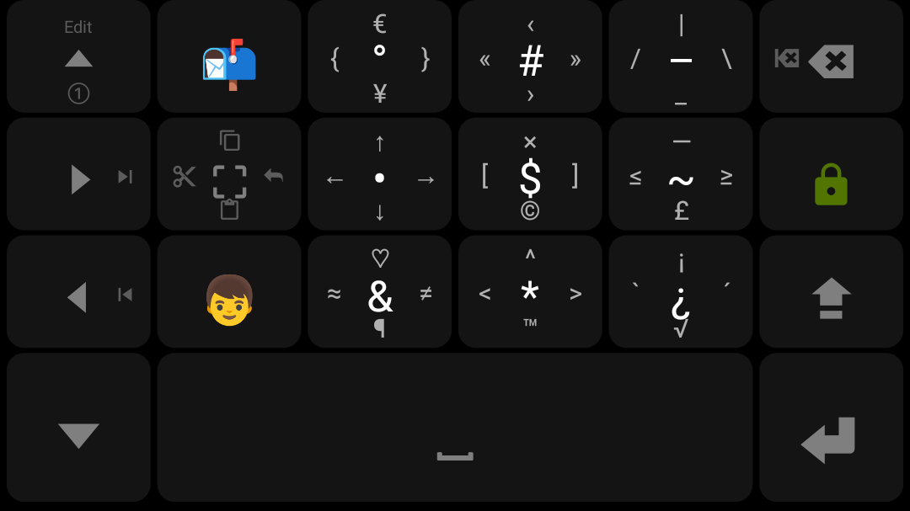
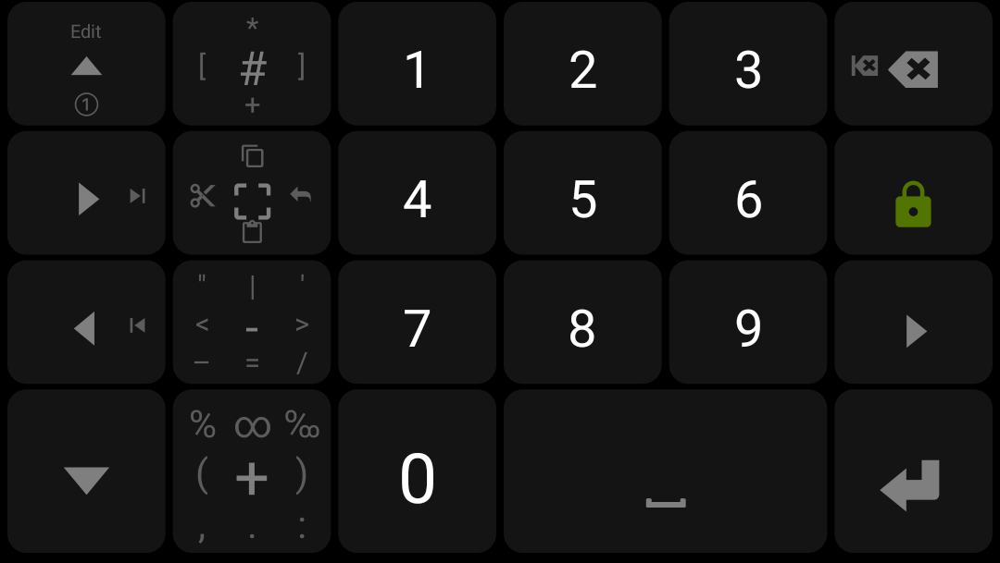
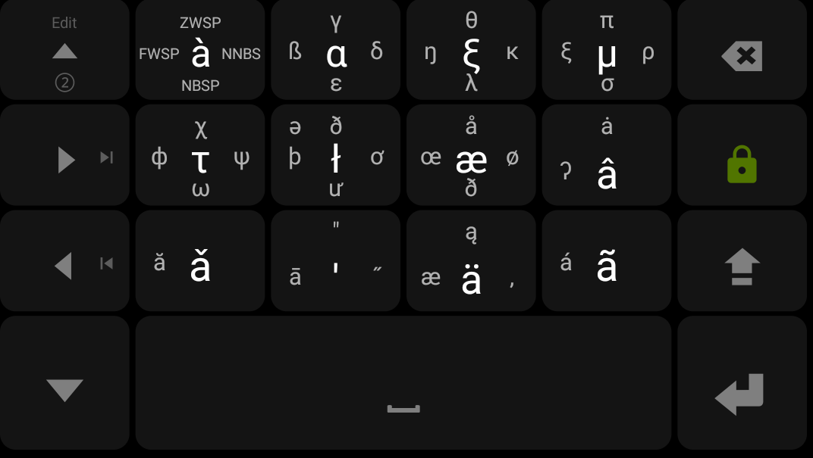
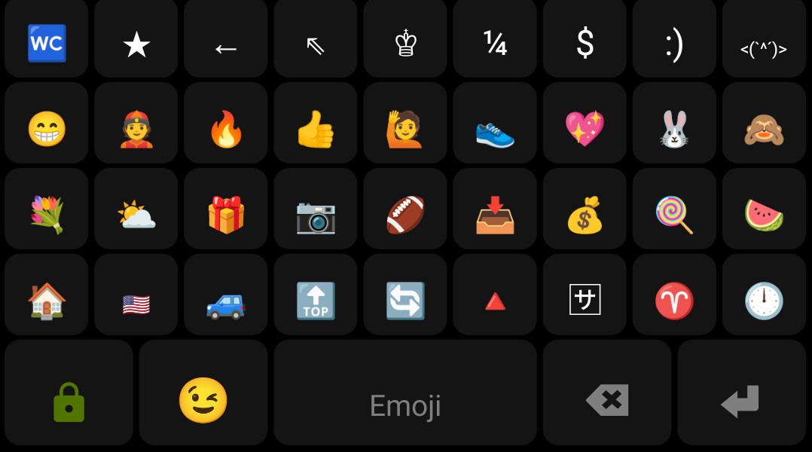

# Multiling-o: MessagEase CS Keyboard Layout

My custom configuration files for the [Multiling-o](https://play.google.com/store/apps/details?id=kl.ime.oh&hl=en&gl=US) keyboard. 

Building upon the [MessagEase](https://play.google.com/store/apps/details?id=com.exideas.mekb&hl=cs&gl=US) keyboard, adapted for the Czech language.

## Features
- **Messsagease-like layout** based on swipe-to-insert,
- full support of Czech accented letters,
- single / double-handed mode,
- extra modes for inserting numbers & special characters,
- **no autocorrect** 😎 💛

## Preview

  

## Details
I was a devoted user of the [MessagEase](https://play.google.com/store/apps/details?id=com.exideas.mekb&hl=cs&gl=US) keyboard. Unlike typical QWERTY keyboards, this keyboard allows to insert characters by swiping on the buttons. 
This made my typing much more pleasant and error-prone and most importantly – it allowed me to get rid of autocorrect.

However, the keyboard is not well supported anymore, so I decided to switch to **[Multiling-o](https://play.google.com/store/apps/details?id=kl.ime.oh&hl=en&gl=US)**, which is an extremely configurable Android keyboard.  

I adopted the Messagease layout and did some custom tweaks to it. I believe it is a good starting point for anybody trying to build a custom swipable keyboard out of Multiling-o.

For more screenshots see below :wink:

## How to use

### Quickstart
Cloning my setup is fairly simple:
1. download [Multiling-o](https://play.google.com/store/apps/details?id=kl.ime.oh&hl=en&gl=US) from Google Play,
2. go to `Layouts - DIY - (Space bar) Layouts... - [+ DIY]`,
3. paste the content of `messagease-cs-base.json`,
3. repeat the steps 2&3 with `messagease-cs-double.json`,
4. go to `Settings - Misc. - Import | Export - Theme`,
5. paste the content of `theme.cfg`.

### Customizing the layout
If you wish to edit the layout, edit the JSON files externally and then paste it using the "Layouts..." button inside the app.

The structure of the JSON files is intuitive:
- for a simple pressable button just use the character itself,
- for a swipable button, use the format `[4D:abcdefghi]` in which:
  - for `a` press the button,
  - for `b`, `c`, `d`, `e` swipe left, up, right, and down,
  - for `f`, `g`, `h`, `i` swipe NE, NW, SW, SE.

Some directions may be omitted using a " " (space).

## Screenshots

### Base

  

### Double

  

### Symbols

  

### Numpad

  

### AltGr

  

### Emoji

  

## Acknowledgements
My deep gratitude goes to [Exideas](https://www.exideas.com/ME/index.php), the creators of the original MessagEase keyboard. Without it, typing on touchscreens would be a pain in the a*s 🙈

And my admiration goes to [Honso](https://play.google.com/store/apps/developer?id=Honso&hl=en&gl=US), who have made something which is very hard to find in today's software world – an app which is powerful, perfectly configurable, and completely free :heart: